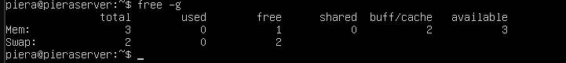

Hier kann man die CPUs von meinem Host-System sehen.

Hier kann man denn Arbeitsspeicher von meinem Host-System sehen.

Die VM zeigt die Anzahl der zugewiesenen CPUs korrekt an.

Die VM zeigt den korrekt zugewiesenen RAM an.

Wenn ich meiner VM mehr CPUs zuweise, als mein Host-System hat, kommt es zu einer Fehlermeldung. Die Virtualisierungssoftware erkennt, dass mein System nicht genug physische CPU-Kerne hat und verhindert, dass die VM startet.

Ähnlich ist es beim RAM. Wenn ich mehr RAM zuweise, als mein Host-System zur Verfügung hat, bekomme ich ebenfalls eine Fehlermeldung. Die Software erkennt, dass nicht genug physischer Speicher vorhanden ist und blockiert den Start der VM.

### Fazit:
Manchmal kommt es zu Fehlern, wenn man seiner VM mehr Ressourcen zuweisen will, als das Host-System tatsächlich hat. Das passiert, weil die Virtualisierungssoftware erkennt, dass nicht genug physische Ressourcen verfügbar sind. In einigen Fällen funktioniert es aber trotzdem, weil die Software Techniken wie "Overcommitment" nutzt, die mehr virtuelle Ressourcen bereitstellen, als physisch vorhanden sind. Ob es zu Fehlern kommt, kann auch vom Betriebssystem abhängen, da manche Betriebssysteme diese Techniken besser unterstützen und Ressourcen effizienter verwalten als andere.
