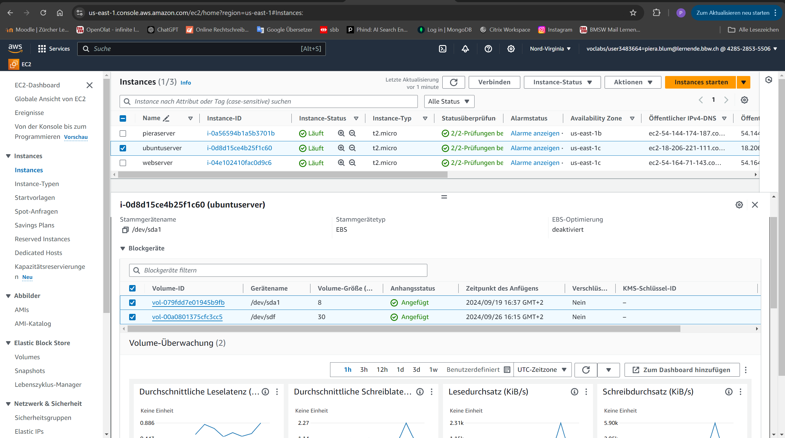
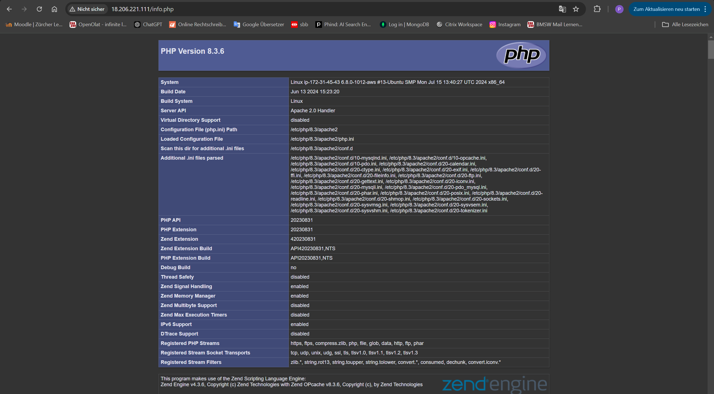
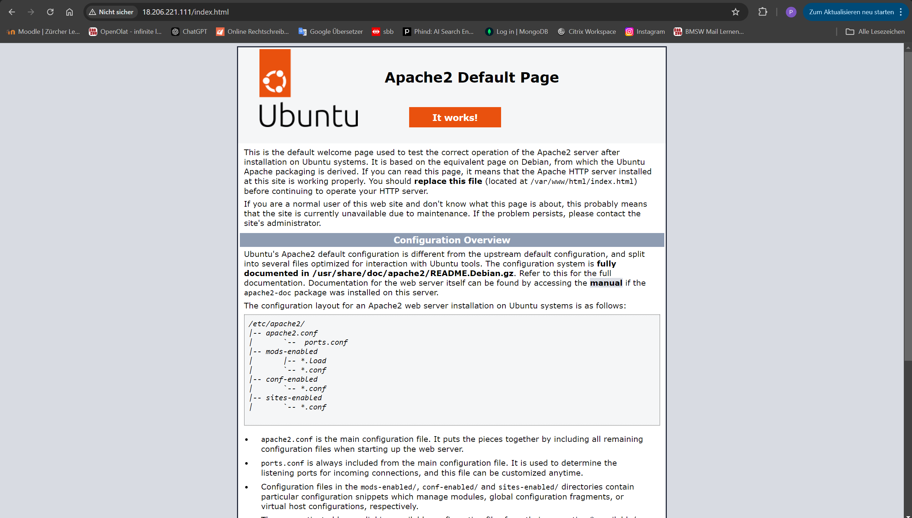
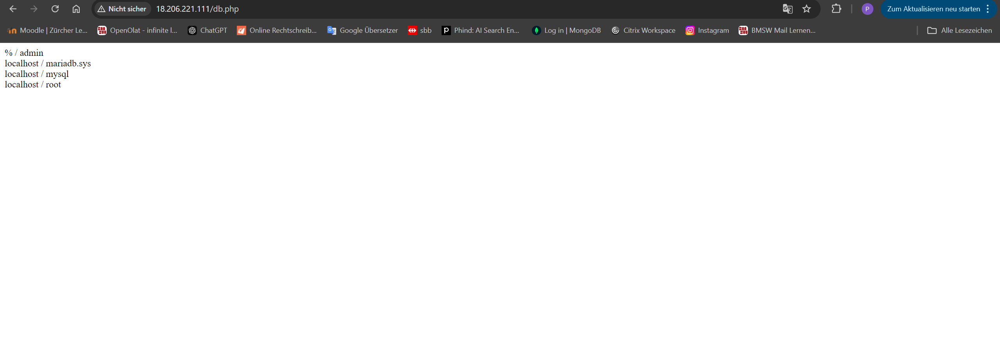
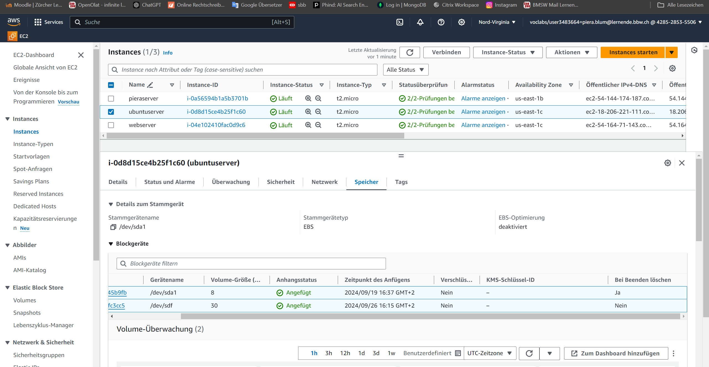

# Verwendung einer zusätzlichen virtuellen Festplatte (EBS-Volume)

Eine zusätzliche virtuelle Festplatte (EBS-Volume) könnte verwendet werden, um:

- **Daten zu speichern**, die von Anwendungen erstellt werden.
- **Backups** oder **Log-Dateien** abzulegen, ohne das Hauptsystem zu belasten.
- **Datenbanken** auszulagern, um die persistenz zu verbessern.

Das Volume bietet flexiblen Speicherplatz für grosse Datenmengen, die getrennt vom Betriebssystem verwaltet werden sollen.