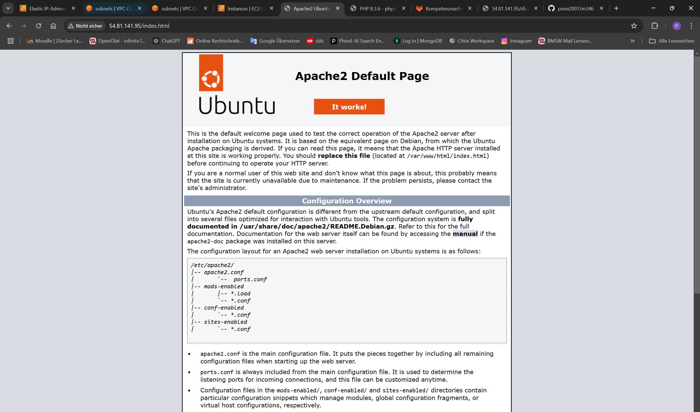
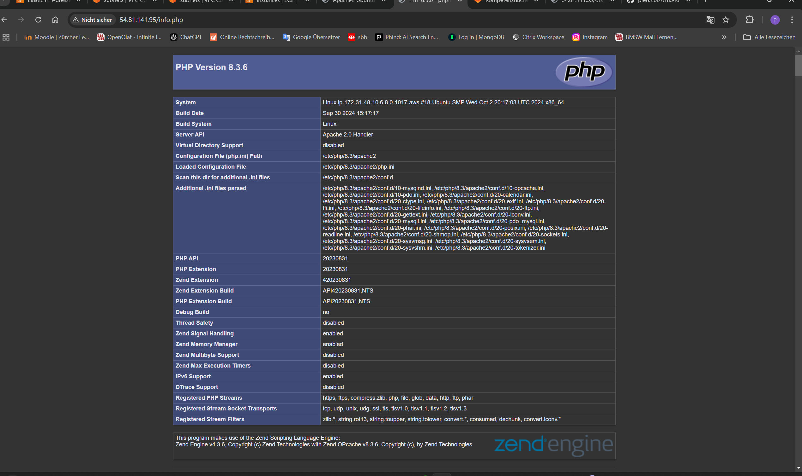
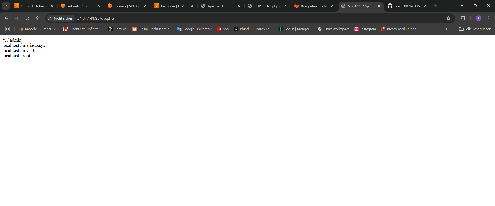

# Netzwerk / Sicherheit - KN04

## A) Diagramm erstellen (10%)

### Diagramm

### Erklärungen
- **VPC**: Eine isolierte Netzwerkumgebung innerhalb der Cloud mit eigenem IP-Raum und Sicherheitsregeln.
- **Subnetz**: Ein untergeordneter IP-Bereich innerhalb einer VPC zur Segmentierung von Ressourcen.

---

## B) Subnetz und private IP wählen (10%)

### Private IP-Adressen
- **Webserver**: `172.31.48.10`
- **Datenbank**: `172.31.48.20`

---

## C) Objekte und Instanzen erstellen (80%)

### 1. Sicherheitsgruppen

 

### 2. Statische IPs

### 3. Netzwerk-Interfaces

---

## Datei-Anpassungen

Die Datei `db.php` wurde angepasst, um eine fehlerfreie Verbindung zur Datenbank herzustellen.

### Seitenaufrufe

---

