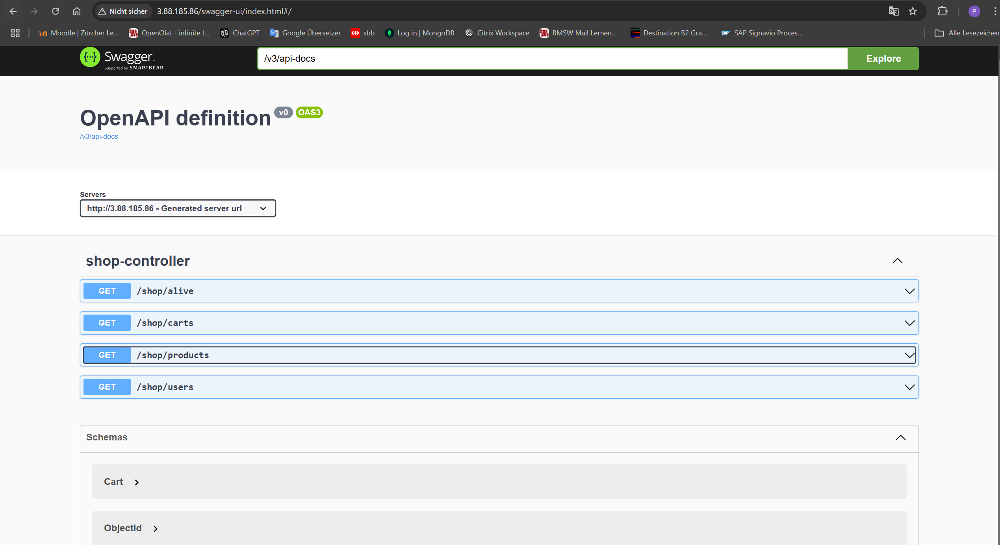
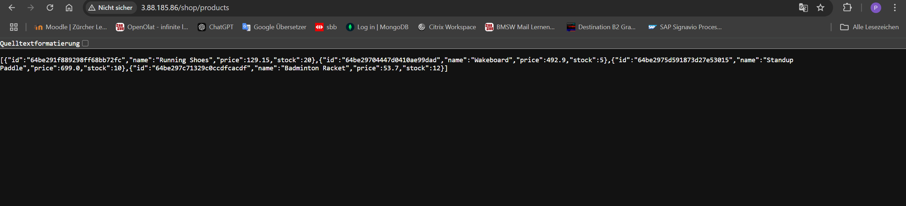
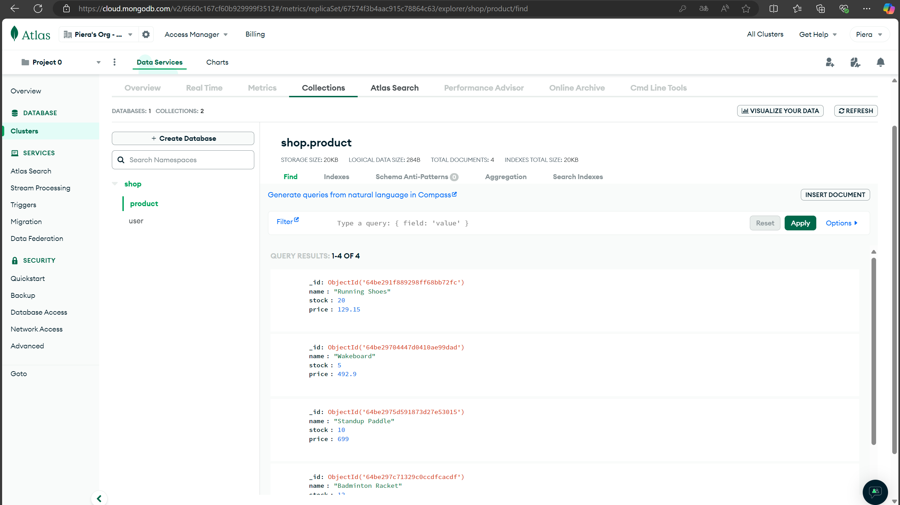
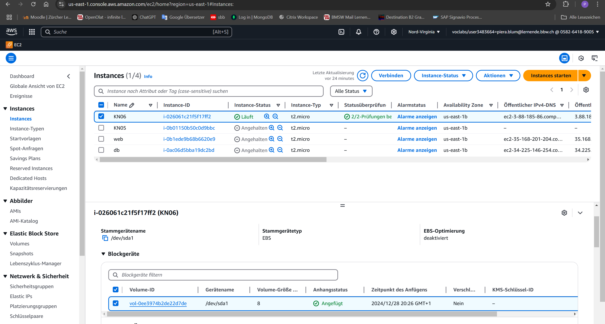
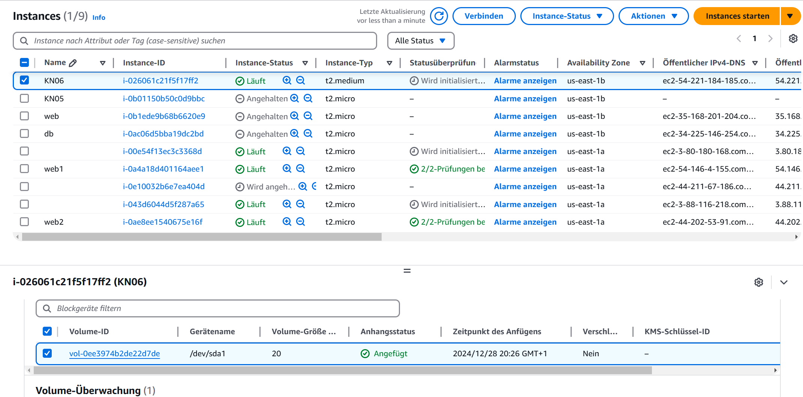
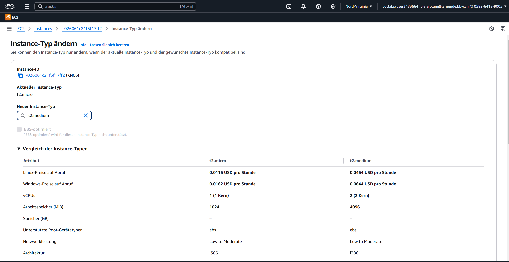
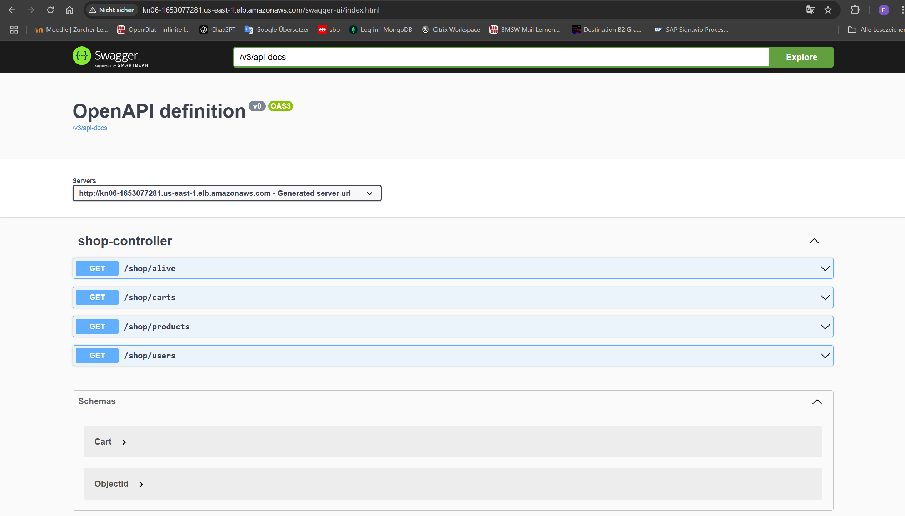

# KN06: Skalierung

## A) Installation App (50%)

### 1. Reverse Proxy erklären
Ein Reverse Proxy ist ein Server, der Anfragen von Clients entgegennimmt und diese an einen oder mehrere Backend-Server weiterleitet. In diesem Kontext wird Nginx verwendet, um Anfragen an die Ports 5000 (für .NET) oder 5001 (für Java) auf Port 80 weiterzuleiten. Dadurch wird die Applikation öffentlich zugänglich.

### 2. Swagger-URL aufrufen

### 3. Endpoint (Products) aufrufen

### 4. MongoDB Collections

## B) Vertikale Skalierung (10%)

### 1. Speicher ändern
**Schritte:**
1. Instanz stoppen.
2. Instanz auswählen und den Speicher über den Bereich **Storage** ändern.
3. Die **Volume ID** öffnen und den Speicher über **Actions → Modify Volume** auf 20GB erweitern.
4. Instanz wieder starten.

### 2. T2Medium Instanztyp ändern
**Schritte:**
1. Instanz stoppen.
2. KN06 Instanz auswählen und über **Actions → Instance Settings → Change Instance Type** den Typ auf **t2.medium** ändern.
3. Instanz wieder starten.

## C) Horizontale Skalierung (20%)
DNS (Domain Name System) ist wie ein Übersetzer fürs Internet. Es wandelt Webadressen (z. B. „google.com“) in IP-Adressen um, die Computer nutzen, um sich gegenseitig zu finden. So kannst du einfach Namen eingeben, statt komplizierte Zahlenreihen.

### 2. Swagger über Load Balancer aufrufen

