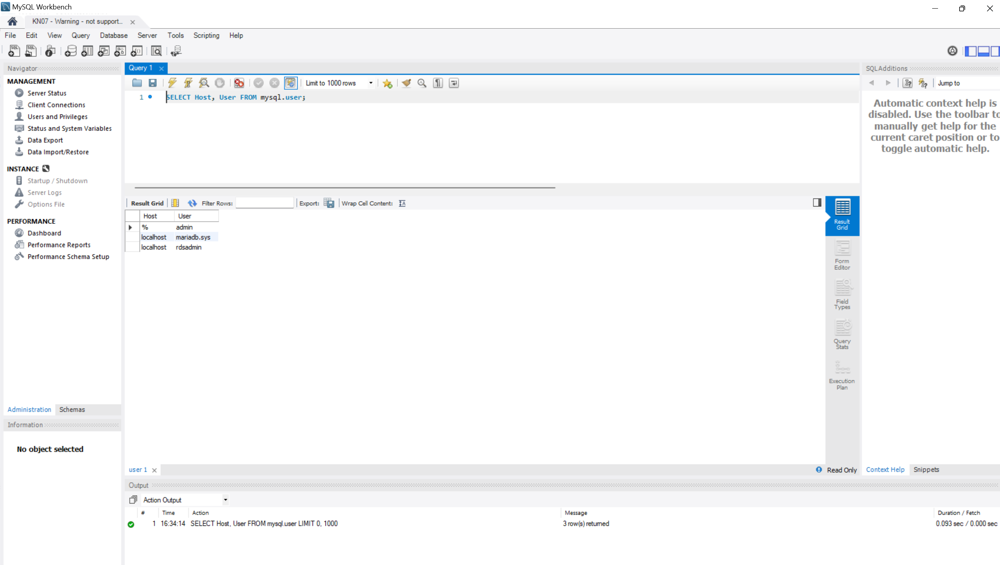
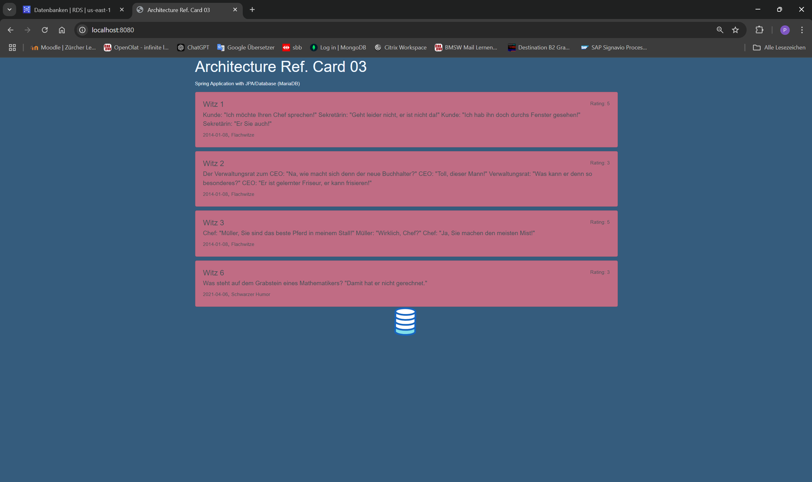
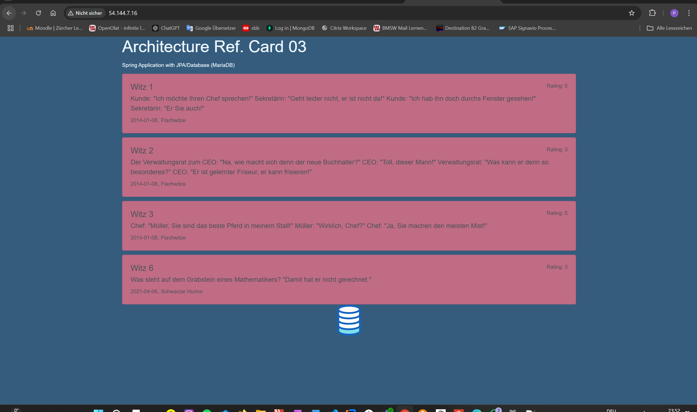

# KN07: Java und DB-PAAS

## A) Datenbank im PAAS-Modell (20%)
   
   

2. **Vorteile von PaaS/SaaS gegenüber eigener Installation**  
   - **Weniger Administrationsaufwand**: Anbieter (z. B. AWS) übernimmt Betriebssystem-Updates, Patchen und Monitoring.  
   - **Automatische Backups und einfache Wiederherstellung**: Vermeidet Datenverlust durch integrierte Backup-Lösungen.  
   - **Skalierbarkeit bei Bedarf**: Automatisch hoch- oder herunterfahren, ohne großen Konfigurationsaufwand.  
   - **Hohe Verfügbarkeit**: Provider unterstützt Multi-AZ oder redundante Setups von Haus aus.  
   - **Schneller Start**: Sofort nutzbar, ohne aufwendige Hardware- oder Softwareinstallationen.  

---

## B) Applikation lokal erstellen (40%)
   
---

## C) Applikation als IAAS hosten (40%)

