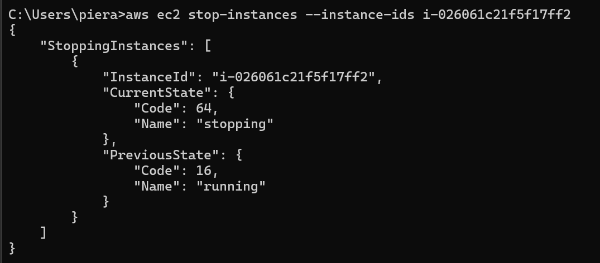
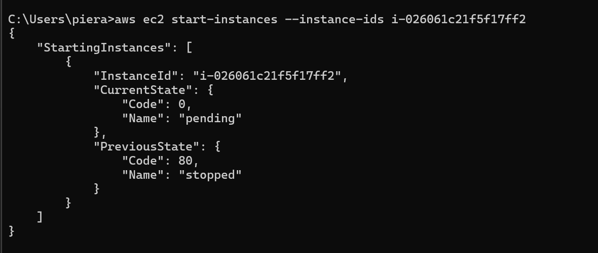
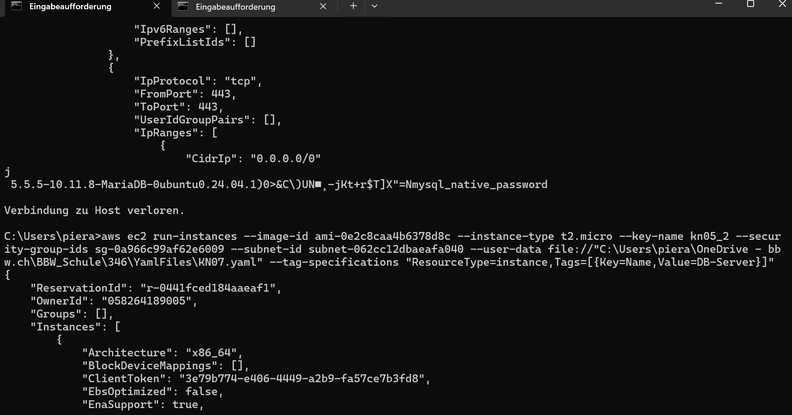
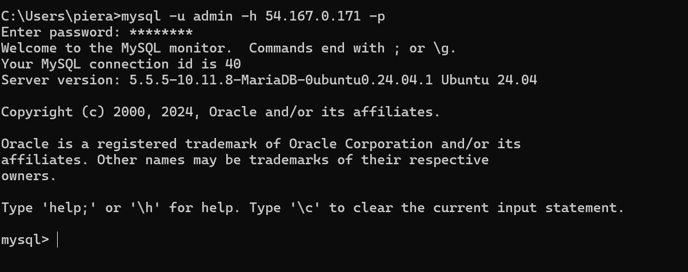
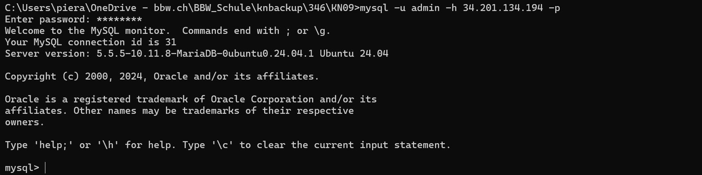

# KN09: Automation

## A) Automatisierung mit Command Line Interface (CLI) (30%)
- **Befehl zum Anzeigen von Informationen zu EC2-Instanzen:**
     ```bash
     aws ec2 describe-instances
     ```
     - **Befehl zum Festlegen der Standardregion:**
     ```bash
     aws configure set region us-east-1
     ```
   - **Befehl zum Stoppen:**
     ```bash
     aws ec2 stop-instances --instance-ids i-026061c21f5f17ff2
     ```
     

   - **Befehl zum Starten:**
     ```bash
     aws ec2 start-instances --instance-ids i-026061c21f5f17ff2
     ```
     

   - **Befehl zur Erstellung:**
     ```bash
     aws ec2 run-instances --image-id ami-0e2c8caa4b6378d8c --instance-type t2.micro --key-name kn05_2 --security-group-ids sg-06eacf7d543ded76d --subnet-id subnet-062cc12dbaeafa040 --user-data file://"C:\Users\piera\OneDrive - bbw.ch\BBW_Schule\346\YamlFiles\cloud-init-db.yaml" --tag-specifications "ResourceType=instance,Tags=[{Key=Name,Value=DB-Server}]"
     ```
     

   - **Befehl zum Testen der Verbindung:**
     ```bash
     mysql -u admin -h 54.167.0.171 -p
     ```
     
---

## B) Terraform (70%)

 **Terraform CLI Befehle:**
   - **Initialisieren:**
     ```bash
     terraform init
     ```
   - **Plan erstellen:**
     ```bash
     terraform plan
     ```
   - **Ressourcen anwenden:**
     ```bash
     terraform apply
     ```
   - **Befehl zum Testen der Verbindung:**
     ```bash
     mysql -u admin -h 54.210.131.148 -p
     ```
     
---
